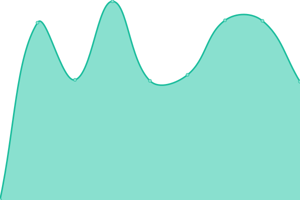

# [📈 Live Status](https://FTRPRF.github.io/upptime): <!--live status--> **🟩 All systems operational**

This repository contains the open-source uptime monitor and status page for [FTRPRF](https://ftrprf.be/), powered by [Upptime](https://github.com/upptime/upptime).

With [Upptime](https://upptime.js.org), you can get your own unlimited and free uptime monitor and status page, powered entirely by a GitHub repository. We use [Issues](https://github.com/FTRPRF/upptime/issues) as incident reports, [Actions](https://github.com/FTRPRF/upptime/actions) as uptime monitors, and [Pages](https://FTRPRF.github.io/upptime) for the status page.

<!--start: status pages-->
<!-- This summary is generated by Upptime (https://github.com/upptime/upptime) -->
<!-- Do not edit this manually, your changes will be overwritten -->
<!-- prettier-ignore -->
| URL | Status | History | Response Time | Uptime |
| --- | ------ | ------- | ------------- | ------ |
|  [CodeFever](https://www.codefever.be) | 🟩 Up | [code-fever.yml](https://github.com/FTRPRF/upptime/commits/HEAD/history/code-fever.yml) | 

 1448ms
     
 | 

<a href="https://uptime.ftrprf.be/history/code-fever">100.00%</a>
    

|  [FTRPRF](https://www.ftrprf.be) | 🟩 Up | [ftrprf.yml](https://github.com/FTRPRF/upptime/commits/HEAD/history/ftrprf.yml) | 

 2941ms
     
 | 

<a href="https://uptime.ftrprf.be/history/ftrprf">99.52%</a>
    

|  [CodeCosmos](https://www.codecosmos.com) | 🟩 Up | [code-cosmos.yml](https://github.com/FTRPRF/upptime/commits/HEAD/history/code-cosmos.yml) | 

 445ms
     
 | 

<a href="https://uptime.ftrprf.be/history/code-cosmos">100.00%</a>
    

|  [CodeFever APP](https://app.codefever.be) | 🟩 Up | [code-fever-app.yml](https://github.com/FTRPRF/upptime/commits/HEAD/history/code-fever-app.yml) | 

 954ms
     
 | 

<a href="https://uptime.ftrprf.be/history/code-fever-app">100.00%</a>
    

<!--end: status pages-->

[**Visit our status website →**](https://FTRPRF.github.io/upptime)

## 📄 License

- Powered by: [Upptime](https://github.com/upptime/upptime)
- Code: [MIT](./LICENSE) © [FTRPRF](https://ftrprf.be/)
- Data in the `./history` directory: [Open Database License](https://opendatacommons.org/licenses/odbl/1-0/)
